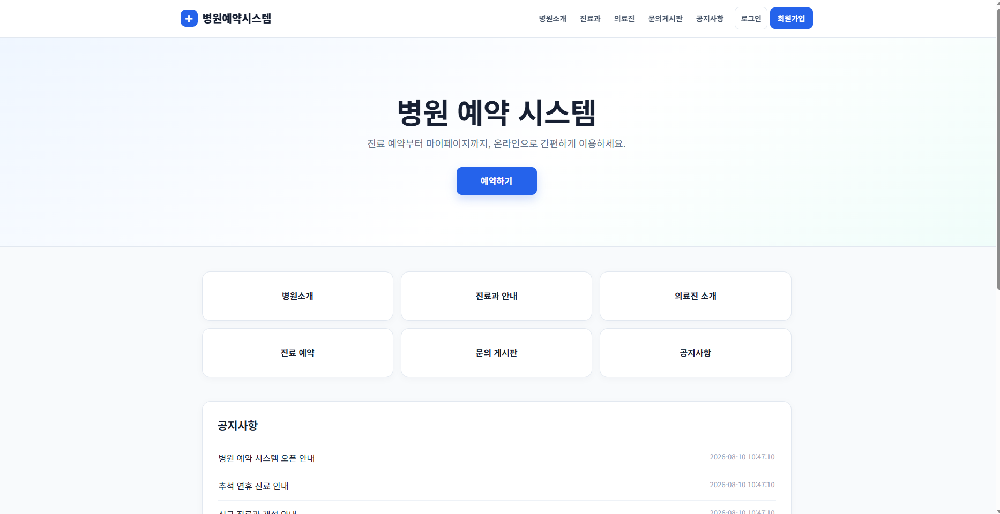
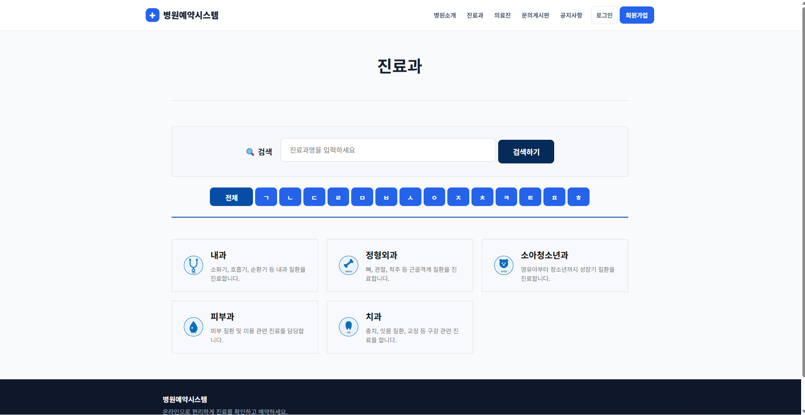
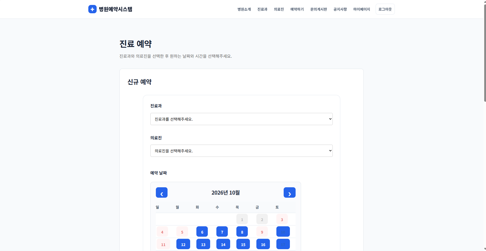
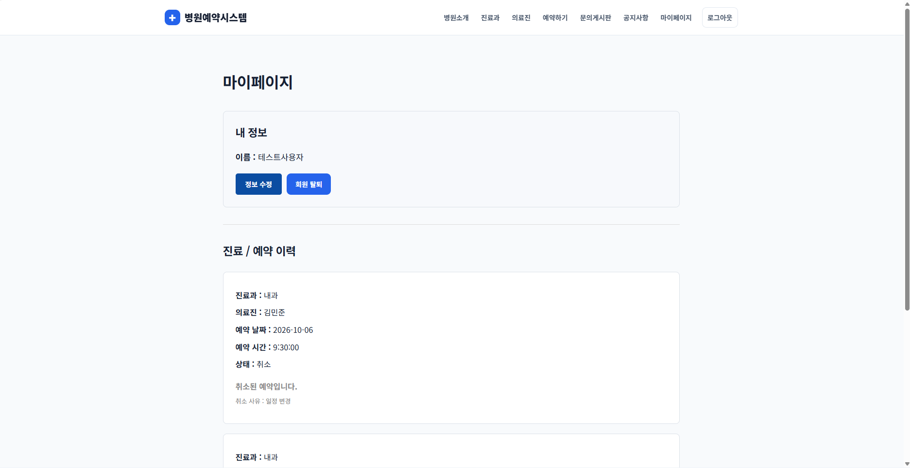
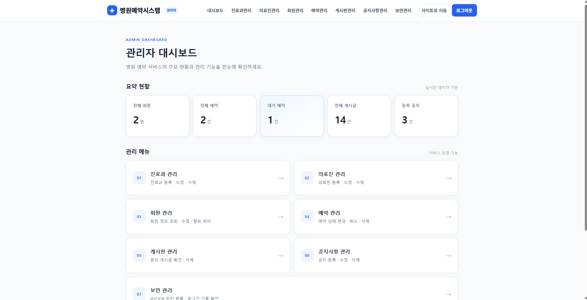
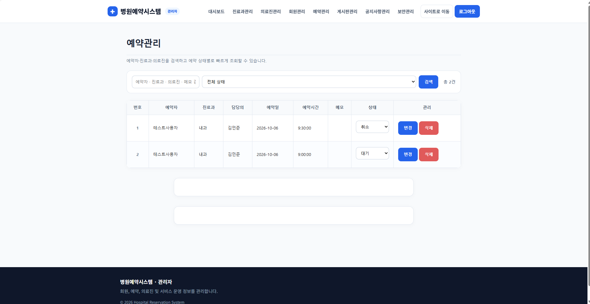
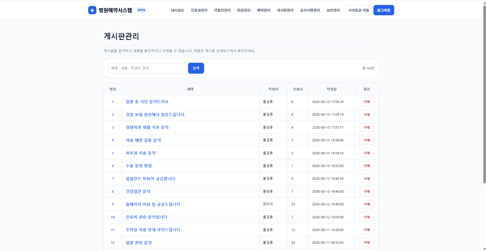
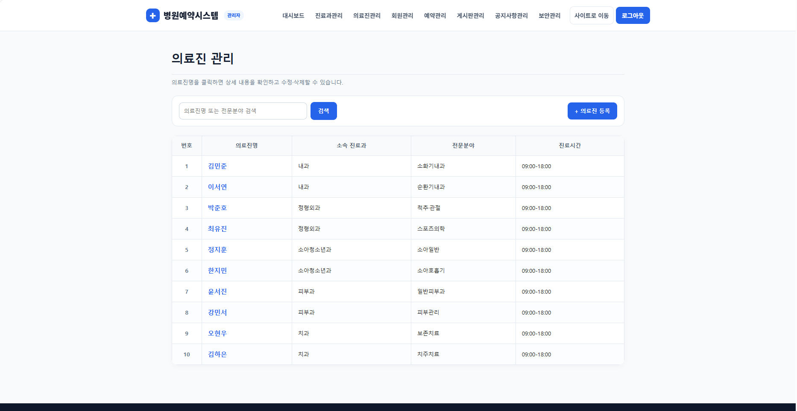

<div align="center">

# 🏥 병원 예약 관리 시스템

**Flask · MySQL 기반 병원 예약 및 관리자 웹 애플리케이션**


사용자의 **진료 조회 → 예약 → 예약 이력 관리**와  
관리자의 **회원·예약·진료과·의료진·게시판·공지사항 통합 관리**를 구현한 웹 프로젝트입니다.

</div>

---

## 📌 프로젝트 소개

병원 예약 관리 시스템은 사용자가 진료과와 의료진을 확인하고 원하는 진료를 예약할 수 있도록 구현한 Flask 기반 웹 애플리케이션입니다.

회원가입과 로그인부터 예약 관리, 게시판, 공지사항, 마이페이지까지 사용자 기능을 제공하며, 관리자는 별도의 관리자 페이지에서 회원·예약·진료과·의료진·게시판·공지사항 등을 통합 관리할 수 있습니다.

포트폴리오 버전에서는 기존 기능을 유지하면서 **관리자 기능과 DB 연동을 점검하고, 사용자/관리자 UI·검색 기능·목록 가독성·저장소 보안 설정을 개선**했습니다.

---

## ✨ 주요 기능

### 👤 사용자

| 기능 | 설명 |
|---|---|
| 회원가입 / 로그인 | 사용자 계정 생성 및 로그인·로그아웃 |
| 병원 / 진료과 조회 | 병원 정보, 진료과 및 의료진 정보 확인 |
| 진료 예약 | 진료과와 의료진을 선택하여 예약 |
| 예약 관리 | 본인의 예약 내역 조회·수정·취소 |
| 진료 내역 | 마이페이지에서 진료 관련 정보 조회 |
| 게시판 | 게시글 작성·조회·수정 및 댓글 기능 |
| 공지사항 | 병원 공지사항 조회 |
| 마이페이지 | 회원정보 수정 및 서비스 이용 내역 확인 |

### ⚙️ 관리자

| 기능 | 설명 |
|---|---|
| 관리자 대시보드 | 회원·예약·게시글·공지사항 현황 요약 |
| 회원 관리 | 회원 목록 조회 및 관리 |
| 예약 관리 | 전체 예약 조회 및 상태 관리 |
| 진료과 관리 | 진료과 등록·수정·삭제 |
| 의료진 관리 | 의료진 등록·수정·삭제 |
| 게시판 관리 | 게시글 검색·조회·삭제 |
| 공지사항 관리 | 공지사항 등록·조회·수정·삭제 |
| 검색 / 필터 | 관리 데이터에 맞춘 검색 및 조회 기능 |
| 보안 관리 | 관리자용 보안 관련 기록 조회 |

---

## 🙋 담당 및 포트폴리오 개선

### 담당 기능

- 관리자 회원 관리
- 관리자 예약 관리
- 관리자 게시판 / 공지사항 관리
- 진료비·매출 관련 데이터 조회 기능
- MySQL 데이터베이스 연동 및 관리자 CRUD 기능 점검

### 포트폴리오 버전 개선

기존 프로젝트를 그대로 제출하는 데 그치지 않고 실제 서비스에 가까운 사용성을 목표로 기능과 화면을 정리했습니다.

- 사용자 페이지와 관리자 페이지의 디자인 시스템 및 CSS 통일
- 관리자 전용 대시보드를 카드형 UI로 재구성
- 관리 페이지의 검색 영역과 등록 버튼 배치를 일관된 형태로 개선
- 게시판 관리자 검색 기능 추가 및 삭제 UI 개선
- DB의 실제 PK 대신 화면용 순번을 적용하여 목록 가독성 개선
- 진료과·의료진·회원·예약·게시판·공지사항 관리 화면 정리
- 반응형 레이아웃 및 공통 헤더·내비게이션·푸터 개선
- 기존 코드와 MySQL 스키마 간 불일치 문제 수정
- 환경변수와 로컬 개발환경 파일을 Git에서 분리하여 저장소 보안 개선

---

## 🧩 트러블슈팅

### 1. 코드와 DB 스키마 불일치

**문제**

기존 DB 구조와 현재 코드가 달라 일부 관리자 기능에서 Unknown column 오류가 발생했습니다.

**해결**  
오류가 발생한 쿼리와 실제 테이블 구조를 비교하고 필요한 컬럼을 보완했습니다. 예약 취소 사유와 진료과 표시 순서 등 코드에서 요구하는 데이터를 DB 구조와 일치시켰습니다.

**결과**  
예약 취소 및 진료과 관리 등 기존에 오류가 발생하던 관리자 기능을 정상화했습니다.

### 2. 관리자 비밀번호 해시 오류

**문제**

관리자 비밀번호 변경 과정에서 해시 문자열 일부가 누락되어 Werkzeug가 해시 방식을 인식하지 못하는 문제가 발생했습니다.

**해결**  
Werkzeug가 생성한 전체 비밀번호 해시 값을 DB에 저장하도록 수정했습니다.

**결과**  
관리자 로그인 인증이 정상적으로 처리되었습니다.

### 3. 관리자 UI 및 검색 기능 개선

**문제**

각 관리 화면마다 검색·등록·삭제 UI의 위치와 형태가 달라 사용성이 떨어지는 문제가 있었습니다.

**해결**  
공통 CSS와 관리 화면용 툴바를 구성하고 버튼·테이블·검색 영역을 동일한 디자인 규칙으로 정리했습니다. DB PK 대신 화면용 순번을 적용하고 게시판에 제목·내용·작성자 검색 기능을 추가했습니다.

**결과**  
관리 화면의 일관성과 데이터 탐색 편의성을 개선했습니다.

---

## 🛠️ 기술 스택

| 구분 | 기술 |
|---|---|
| Backend | Python 3.12, Flask |
| Database | MySQL |
| Frontend | HTML5, CSS3, JavaScript, Jinja2 |
| Authentication | Flask Session, Werkzeug Password Hash |
| Development | PyCharm |
| Version Control | Git, GitHub |

---

## 🗂️ 프로젝트 구조

```text
hospital-reservation-portfolio/
├── admin/                 # 관리자 기능
├── auth/                  # 회원가입 / 로그인
├── board/                 # 게시판
├── hospital/              # 병원 / 진료과 / 의료진
├── reservation/           # 예약 기능
├── docs/
│   └── images/            # README 화면 이미지
├── static/
│   ├── css/               # 공통 및 관리자 스타일
│   └── js/                # JavaScript
├── templates/             # Jinja2 HTML 템플릿
├── app.py
├── app_blueprint.py       # Blueprint 기반 실행 진입점
├── db.py                  # MySQL 연결
├── requirements.txt
└── README.md
```

---

## 🚀 실행 방법

### 1. 저장소 복제

```bash
git clone https://github.com/cow-jung/hospital-reservation-portfolio.git
cd hospital-reservation-portfolio
```

### 2. 가상환경 생성 및 활성화

Windows 기준:

```powershell
py -3.12 -m venv .venv
.\.venv\Scripts\Activate.ps1
```

### 3. 패키지 설치

```powershell
python -m pip install -r requirements.txt
```

### 4. 환경변수 설정

프로젝트 루트에 `.env` 파일을 생성하고 로컬 MySQL 접속 정보를 설정합니다.

> `.env` 파일은 민감정보 보호를 위해 Git에 포함하지 않습니다.

### 5. 실행

```powershell
python app_blueprint.py
```

브라우저에서 다음 주소로 접속합니다.

```text
http://127.0.0.1:5000
```

---

## 🖥️ 주요 화면

### 1. 메인 화면

서비스의 주요 기능인 진료과·의료진 조회, 진료 예약, 문의게시판, 공지사항으로 이동할 수 있는 사용자 메인 화면입니다.



### 2. 진료과 조회

진료과를 검색하거나 초성으로 조회할 수 있으며, 각 진료과의 주요 진료 분야를 확인할 수 있습니다.



### 3. 진료 예약

진료과와 의료진을 선택한 뒤 달력에서 원하는 날짜와 시간을 선택하여 예약할 수 있습니다.



### 4. 마이페이지

사용자 정보를 수정하고 본인의 진료·예약 이력과 예약 상태를 확인할 수 있습니다.



### 5. 관리자 대시보드

회원, 예약, 게시글, 공지사항 현황을 한눈에 확인하고 각 관리 기능으로 이동할 수 있도록 구성했습니다.



### 6. 관리자 예약 관리

예약자·진료과·의료진을 검색하고 예약 상태별로 조회할 수 있으며, 예약 상태 변경 및 삭제 기능을 제공합니다.



### 7. 관리자 게시판 관리

게시글의 제목·내용·작성자를 기준으로 검색할 수 있으며 게시글 조회 및 삭제가 가능합니다.

<table>
<tr>
<td width="50%"></td>
<td width="50%"></td>
</tr>
<tr>
<td align="center"><b>게시판 관리</b></td>
<td align="center"><b>의료진 관리</b></td>
</tr>
</table>

### 8. 관리자 의료진 관리

의료진을 이름 또는 전문분야로 검색하고 진료과·전문분야·진료시간을 확인하며 등록·수정·삭제할 수 있습니다.

> 사용자 기능과 관리자 기능을 분리하고, 공통 디자인 시스템을 적용해 하나의 서비스처럼 일관된 UI로 구성했습니다.

---

## 🔐 저장소 관리

`.env`, `.venv`, `.idea` 등 로컬 환경 및 민감정보 파일은 `.gitignore`를 통해 버전 관리 대상에서 제외했습니다.

---

<div align="center">

**Hospital Reservation Portfolio**  
Flask와 MySQL을 활용한 병원 예약·관리 웹 프로젝트

</div>
